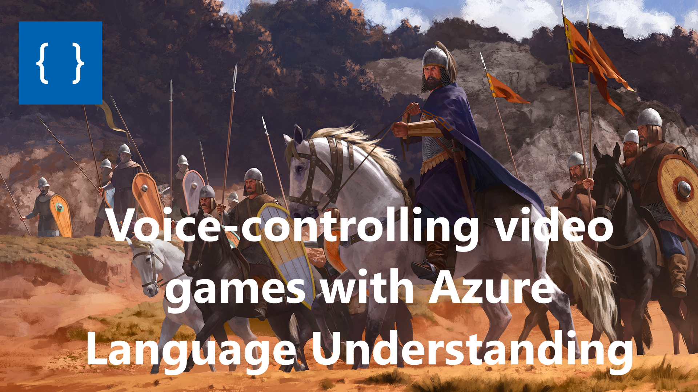

# BannerlordVoiceCommands

## How to use:
1. Create an Azure Account.
1. Create a Language Understanding project at [luis.ai](https://www.luis.ai/). Select existing an Language Understanding resource or create a new one. You can use the free tier.
1. Import the [utterances](bannerlord-voice-commands.lu) or create your own. Train and publish the model.
1. Create a Key Vault resource in Azure. Add endpoint and key information to your Key Vault.
1. Fill in the authentication section of [config.json](config.json).
1. Run the python script. Trigger the voice recognition with M5 (or change line 56 to use a different mouse button).

## Disclaimer
This is just a quick proof-of-concept. The language understanding model is not trained well enough to correctly identify all commands. The code assumes you are using the default key binds, but those can be changed in the config. Units 1-4 can be addressed by their default configuration (infantry, archers, cavalry, horse archers), remaining units can be addressed by e.g. "unit 5".

Note that this has been built on the old version of Language Understanding. LUIS has since been integrated into [Cognitive Services for Language](https://language.cognitive.azure.com/). Consider using the latest version for new projects.
